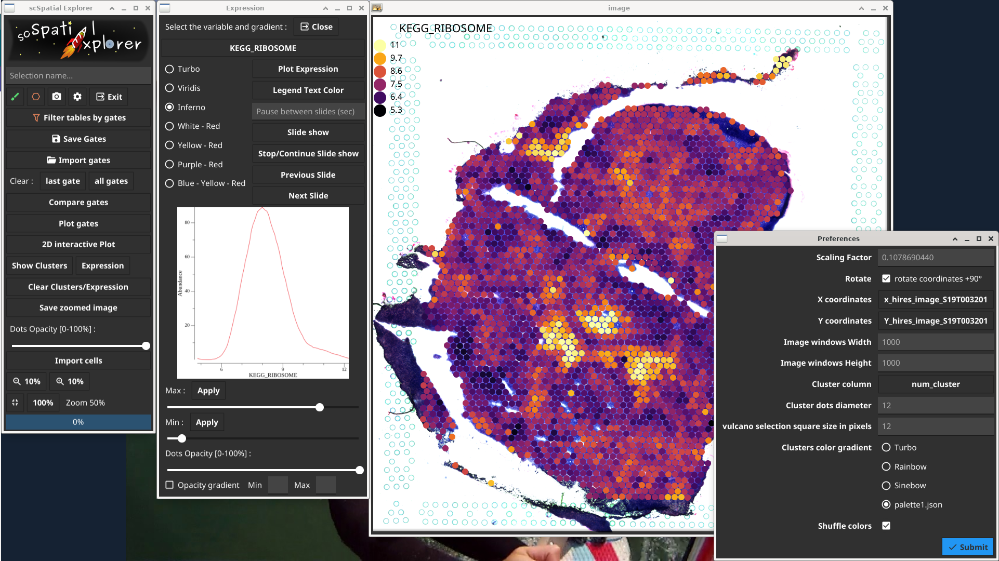
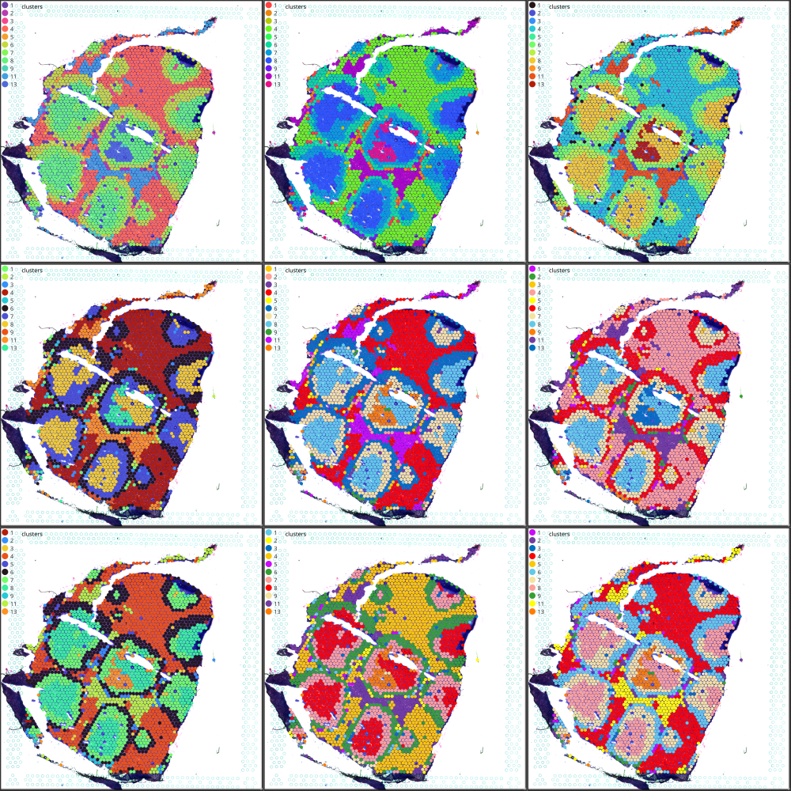
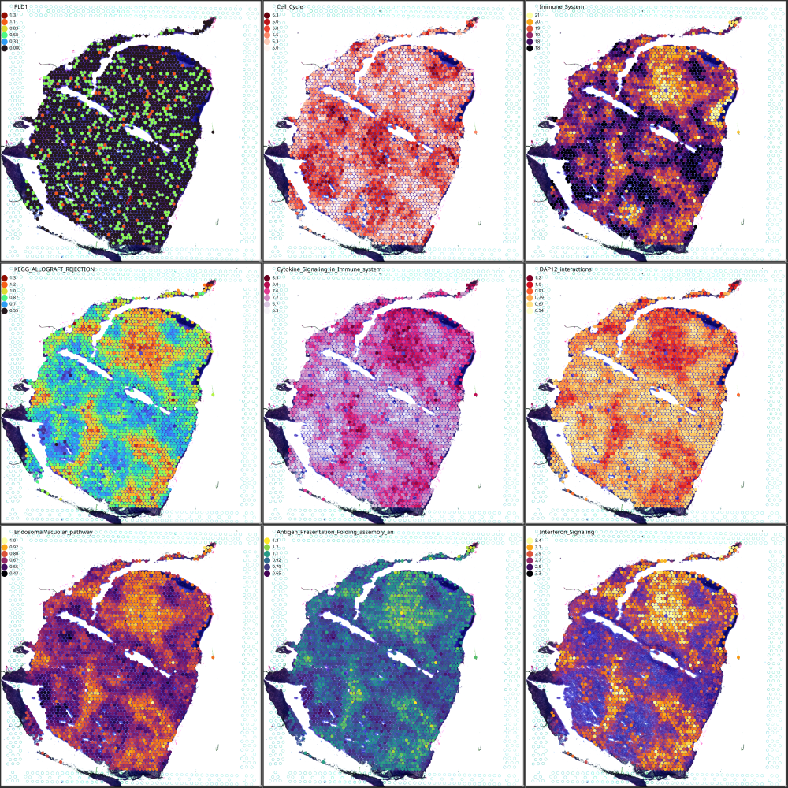
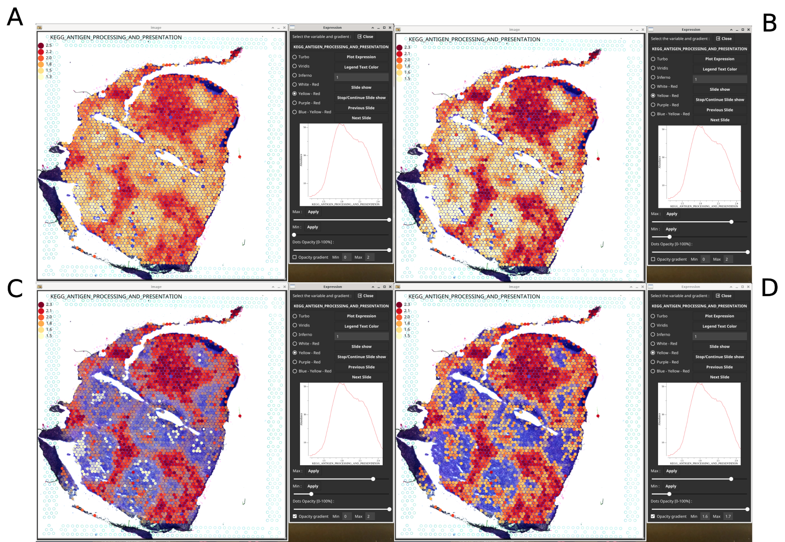
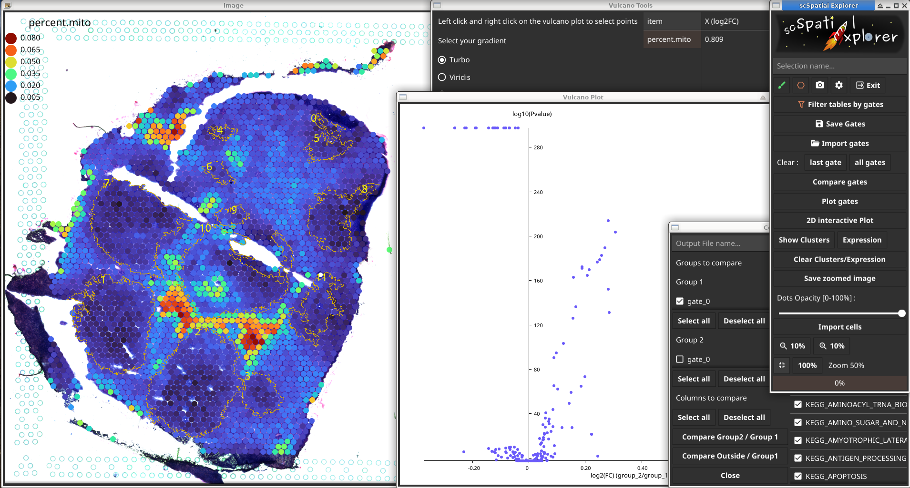
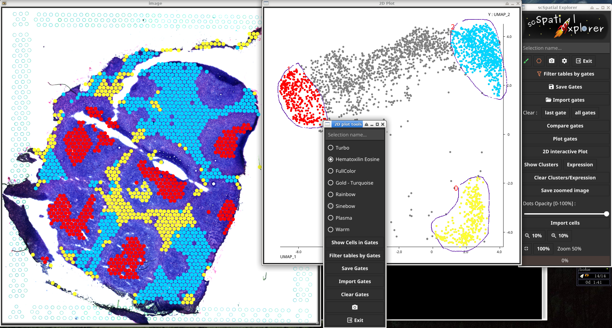
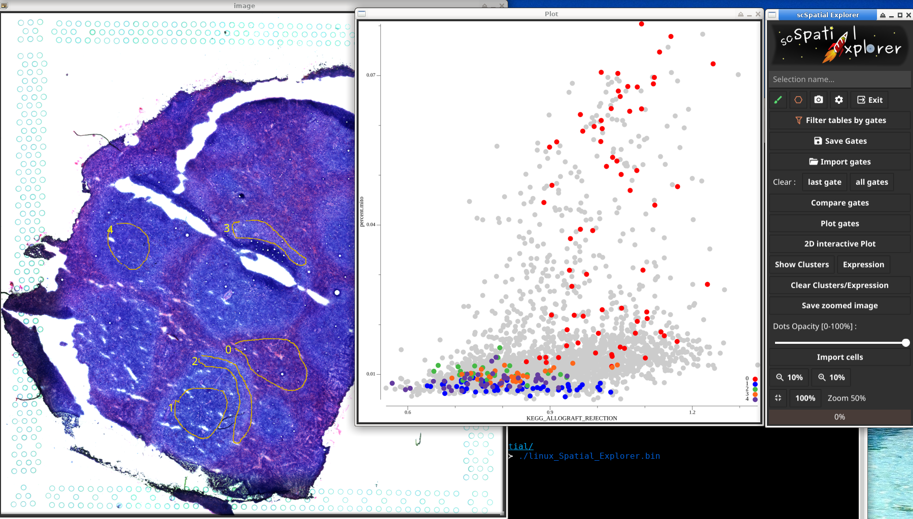
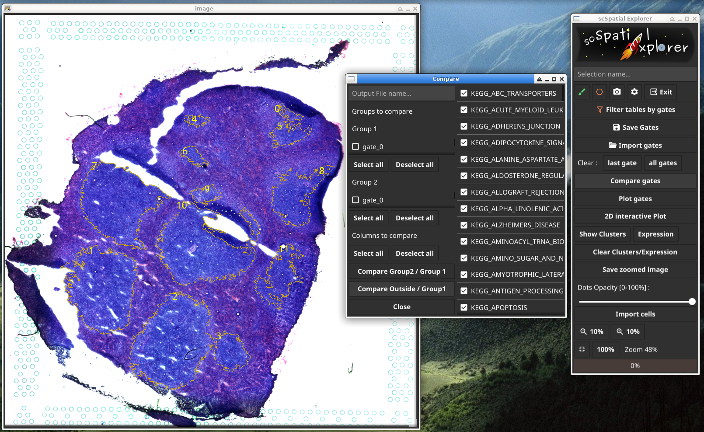

<h1>

 
 

</h1>

Single-Cell Spatial Explorer is a software for user-friendly and versatile exploration of spatial transcriptomic datasets. It is compatible with 
[Single-Cell Signature Explorer](https://doi.org/10.1093/nar/gkz601) (available 
[here](https://sites.google.com/site/fredsoftwares/products/single-cell-signature-explorer)) and 
[Single-Cell Virtual Cytometer](https://doi.org/10.1093/nargab/lqaa025) (available 
[here.](https://github.com/FredPont/single-cell-virtual-cytometer))

For more details see the <b><a href="doc/Manual_Single_Cell_Spatial_Explorer.pdf" target="_blank">Manual</a></b>
inside the doc folder

<!---[Contact](mailto:frederic.pont@inserm.fr)--->

<!---How to [Cite](https://doi.org/10.1093/nargab/lqaa025) --->

<!---Demo videos can be found in the supplemental data of the [reference article](https://doi.org/10.1093/nargab/lqaa025) --->

 

## ScreenShots

Single-Cell Spatial Explorer is a compiled software, easy to install and to use. It produces beautiful pictures from microcopy images and single cell data sets. Many information can be visualized on top on the microscopy image, such as gene expression, clusters, pathways (screenshot), antibodies... :

Single-Cell Spatial Explorer can display clusters with preset color gradients. In this example with 11 clusters there is 159667200 possible representations :

In combination with [Single-Cell Signature Explorer](https://doi.org/10.1093/nar/gkz601), Single-Cell Spatial Explorer can display about 29,000 Human pathways or gene signatures (+ genes, antibodies...) as tunable overlays on a microscopy image. Both transparency and image contrast can be adjusted by the user  :

Single-Cell Spatial Explorer displaying a biological function with different settings of contrast and opacity. A) The original image. B) Contrast was increased with the min/max slider. C) Same image as B) with a wide opacity gradient. D) Same image as C) with a narrow opacity gradient it is possible to display only relevant cells.

Screenshot of Single-Cell Spatial Explorer gate comparison. It is possible to compare gates (or groups of gates) across the whole dataset. A volcano plot is obtained and relevant dots can be clicked to reveal the differential genes, antibodies, biological functions or gene signatures. :

To localize cells of interest on the microscopy image, Single-Cell Spatial Explorer can draw an interactive 2D plot with any coordinates (t-SNE, UMAP, genes, gene signatures, antibodies ...). On this 2D plot it is possible to select dots, display them on the microscopy image and filter datasets to extract sub-tables and cell names corresponding to these dots:

To better characterize cells, Single-Cell Spatial Explorer can plot the gates content on a 2D scatter plot with any coordinates (t-SNE, UMAP, genes, gene signatures, antibodies ...). It is possible to filter datasets to extract sub-tables and cell names corresponding to these dots. Selected cells can be exported to [Single-Cell Virtual Cytometer](https://doi.org/10.1093/nargab/lqaa025) (available 
[here](https://github.com/FredPont/single-cell-virtual-cytometer)) to refine the analysis :

Single-Cell Spatial Explorer can take advantage of years of development in image analysis. It is compatible with [FIJI](https://fiji.sc/) and [ImageJ](https://imagej.nih.gov/ij/). In this picture the contours of tumoral cells have been obtained by FIJI analysis and were imported into Single-Cell Spatial Explorer:

## Prerequisites
A computer with at least 8 Go RAM and a HD display with at least a HD resolution of 1920×1080.

## Installing

To install the software, download the zip archive and unzip it.

 Single-Cell Spatial Explorer is written in pure 
 
  with the Fyne library 
 
statically linked. Precompiled static  binaries are are available for Linux, Mac, and Windows. Installation of Single-Cell Spatial Explorer is immediate.

## Documentation

The documentation is available as a PDF file in the "doc" directory

## Single-Cell Spatial Explorer features.

1.  Single-Cell Spatial Explorer is ready to use in a pre-compiled
    binary, no installation required

2.  cross-platform (the interface and the software are coded in pure Go)

3.  low memory usage

4.  compatible with any PNG image associated with any CSV file (TAB
    separated) containing XY coordinates of the image.

5.  compatible with any numeric data : gene expression, pathway scores, antibody expression etc...

6.  unlimited number of gates.

7.  import/export gates in ImageJ/FIJI format.

8.  extract cells and sub-tables delimited by the gates on an unlimited number of tables. Exportation is done in CSV file for great interoperability.

9.  2D plots of the cells inside the gates with any XY coordinates :
    t-SNE, UMAP, gene expression, pathway scores, antibody expression
    etc...

10. interactive 2D plot to show the selected cells on a t-SNE, UMAP or
    any other coordinates on the image and to filter the data tables
    into sub-tables.

11. cluster display with custom dot opacity and custom dot size.

12. display any kind of cell expression (genes, pathways, antibodies...)
    with 7 preset gradients, custom legend color, dot opacity and custom
    dot size. The gradients are simple two colors maps and rainbow
    colors maps Turbo, Viridis and Inferno to optimize accuracy and
    details visualization.

13. Min/Max intensity sliders to tune image contrast or remove artifacts due to outliers.

14. Expression opacity gradient with min/max threshold.

15. slide show to review many cell expression maps without need of
    repetitive click.

16. screenshot or native resolution image exportation.

17. import and display an unlimited number of cells list by repetitive click on the "import cells" button. The format is directly compatible with Single-Cell Virtual Cytometer .

18. compare two groups of gates together in the whole dataset .

19. compare one group of gates against all the remaining cells.

20. draw an interactive volcano plot after gate comparison.

21. plot cell expression of a selected dot in the volcano plot.

22. export volcano plot and the corresponding data table.

23. image zoom 10-200%

## Acknowledgments
Special thanks to [Andrew Williams](https://andy.xyz), creator of the [Fyne](https://github.com/fyne-io) project and CEO at [Fyne Labs](https://fynelabs.com/), for his useful technical advice about the usage of the [Fyne graphical toolkit](https://fyne.io/).

Thanks to [Miguel Madrid](https://github.com/mimame) for his advices on Github.

The GO developpment team is aknowledged as well as the contributors of the following projects :

[gonum](https://www.gonum.org/), [fc](https://github.com/ajstarks/fc), [colorgrad](https://github.com/mazznoer/colorgrad), [go-colorful](github.com/lucasb-eyer/go-colorful), [stats](github.com/aclements/go-moremath/stats)
