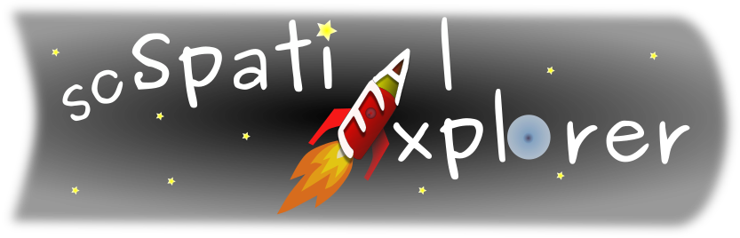

<h1>

Single-Cell Spatial Explorer:
 
 

</h1>

*Single-Cell Spatial Explorer*, is a software for user-friendly and versatile exploration of spatial transcriptomic datasets. Single-Cell Spatial Explorer  is compatible with 
[Single-Cell Signature Explorer](https://doi.org/10.1093/nar/gkz601) available 
[here](https://sites.google.com/site/fredsoftwares/products/single-cell-signature-explorer) and 
[Single-Cell Virtual Cytometer](https://doi.org/10.1093/nargab/lqaa025) available 
[here.](https://github.com/FredPont/single-cell-virtual-cytometer)

For more details see the <b><a href="doc/Manual_Single_Cell_Spatial_Explorer.pdf" target="_blank">Manual</a></b>
inside the doc folder

<!---How to [Cite](https://doi.org/10.1093/nargab/lqaa025) --->

Demo videos can be found in the supplemental data of the [reference article](https://doi.org/10.1093/nargab/lqaa025)

 

## ScreenShots

Single-Cell Spatial Explorer can display clusters :

Single-Cell Spatial Explorer can display about 30,000 Human pathways on a microscopy image  in combination with [Single-Cell Signature Explorer](https://doi.org/10.1093/nar/gkz601) :

Single-Cell Spatial Explorer is compatible with [FIJI](https://fiji.sc/) and [ImageJ](https://imagej.nih.gov/ij/). In this picture the contour of tumoral cells have been obtained by image analysis and were imported into Single-Cell Spatial Explorer:

 Single-Cell Spatial Explorer is written in pure 
 
  with the library 
 
statically linked. Precompiled  static  binaries  areavailable for Linux, Mac and Windows and installation is immediate.

## Acknowledgements
Special thanks to Andrew Williams, CTO and technical leader of [Fyne](https://github.com/fyne-io) project, for  his  useful  technical  advises  about  the usage  of  the  [Fyne  graphical  library](https://fyne.io/).

The GO developpment team is aknowledged as well as the contributors of the following projects :

[gonum](https://www.gonum.org/), [fc](https://github.com/ajstarks/fc), [colorgrad](https://github.com/mazznoer/colorgrad), [go-colorful](github.com/lucasb-eyer/go-colorful), [stats](github.com/aclements/go-moremath/stats)
